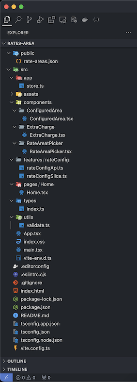

### Подготовка проекта

На данный момент CRA(Create React App) не развивается, поэтому предпочтительней будет использовать
тулинг [ViteJS](https://vitejs.dev/).
Настроить линтеры и форматеры. В документации к ViteJS есть
предсозданные [шаблоны](https://vitejs.dev/guide/#scaffolding-your-first-vite-project) проектов, можно воспользоваться
одним из них.
Шаблон уже включает конфиг для ESLint.
Плюсом будет написать проект на TypeScript.
Так как в условии ничего не указано про использование готовых UI библиотек, то можно использовать любую библиотеку (PrimeReact, AntD, MaterialUI и т.д).

### Структура приложения

```txt
/src
  /app
    - store.ts
  /components
    /RateAreaPicker
      - RateAreaPicker.tsx
    /ConfiguredArea
      - ConfiguredArea.tsx
    /ExtraCharge
      - ExtraCharge.tsx
  /features
    /rateConfig
      - rateConfigSlice.ts
      - rateConfigApi.ts
  /pages
    - Home.tsx
  /types
    - index.ts
  /utils
    - validate.ts
  - App.tsx
  - index.tsx
  - routes.tsx
  - styles.css
```

Для небольшого приложения можно использовать подобную структуру.
Если приложение среднее или большое, то можно использовать структуру, которая будет разделять ui часть от доменной
части.
Например:

```txt
src/
├── api/
│   └── services/
├── assets/
│   ├── images/
│   ├── styles/
│   └── fonts/
├── components/
│   ├── common/
│   └── specific/
├── domain/
│   ├── models/
│   ├── use-cases/
│   └── utils/
├── views/
│   ├── pages/
│   └── layouts/
├── App.js
├── index.js
└── routes/
    └── AppRoutes.js
```

Так как наше приложение небольшое, будем использовать первый вариант.

### Элемент для поиска тарифных зон

1. Список тарифных зон грузится с бэкенда асинхронно.

Для этого проекта нужно импортировать JSON-файл с данными. Его можно разместить в папке public. При импорте в ViteJS
JSON-файлы автоматически парсятся, поэтому их можно использовать сразу. Для хранения данных в приложении я бы
рекомендовал использовать Redux Toolkit. Это удобная библиотека для работы с состоянием приложения. Кроме того, она “из
коробки” предоставляет возможности для работы с API с помощью RTK Query.
BaseApi для запроса данных из JSON-файла может выглядеть так:

```typescript
import { createApi, fetchBaseQuery } from '@reduxjs/toolkit/query/react';
import type { RateAreaType } from '../../types';

export const rateConfigApi = createApi({
      reducerPath: 'rateConfigApi',
      baseQuery: fetchBaseQuery({baseUrl: '/'}),
      endpoints: (builder) => ({
        getRateAreas: builder.query <RateAreaType[], void>({
          query: () => 'rate-areas.json',
        }),
      }),
    }
  )
;
```

Либо можно использовать обычный Fetch API для получения данных.

Слайс для хранения может выглядеть подобным образом:

```typescript
export interface RateConfigState {
  configuredAreas: ConfiguredAreaType[];
}

const initialState: RateConfigState = {
  configuredAreas: [],
};

const rateConfigSlice = createSlice({
  name: 'rateConfig',
  initialState,
  reducers: {
    addConfiguredArea: (state, action: PayloadAction<RateAreaType>) => {
      const area = action.payload;
      state.configuredAreas.push({...area, baseChargeValue: '', extraCharges: []})
    },
    removeConfiguredArea: (state, action: PayloadAction<string>) => {
      state.configuredAreas = state.configuredAreas.filter((area) => area.id !== action.payload);
    },
    updateBaseCharge: (state, action: PayloadAction<{ id: string; value: string }>) => {
      const {id, value} = action.payload;
      const area = state.configuredAreas.find((area) => area.id === id);
      if (area) {
        area.baseChargeValue = value;
      }
    },
    addExtraCharge: (state, action: PayloadAction<string>) => {
      const area = state.configuredAreas.find((area) => area.id === action.payload);
      if (area) {
        area.extraCharges.push({
          id: Date.now().toString(),
          minWeight: '',
          maxWeight: '',
          chargeValue: '',
          baseChargeValue: area.baseChargeValue
        });
      }
    },
    updateExtraCharge: (state, action: PayloadAction<{
      areaId: string;
      chargeId: string;
      field: string;
      value: string
    }>) => {
      const {areaId, chargeId, field, value} = action.payload;
      const area = state.configuredAreas.find((area) => area.id === areaId);
      if (area) {
        const charge = area.extraCharges.find((charge) => charge.id === chargeId);
        if (charge) {
          (charge
          as
          unknown
          as
          Record <string, string>
        )
          [field] = value;
        }
      }
    },
    removeExtraCharge: (state, action: PayloadAction<{ areaId: string; chargeId: string }>) => {
      const {areaId, chargeId} = action.payload;
      const area = state.configuredAreas.find((area) => area.id === areaId);
      if (area) {
        area.extraCharges = area.extraCharges.filter((charge) => charge.id !== chargeId);
      }
    },
  },
});

export const {
  addConfiguredArea,
  removeConfiguredArea,
  updateBaseCharge,
  addExtraCharge,
  updateExtraCharge,
  removeExtraCharge,
} = rateConfigSlice.actions;

export default rateConfigSlice.reducer;
```

2. Элемент поддерживает фильтрацию по названию

Для этого проекта необходим компонент для ввода данных. Это будет input, который принимает данные от пользователя и
фильтрует список с тарифными зонами по вхождению.

3. Нажатие на "Добавить" рядом с названием тарифной зоны добавляет ее в список настроенных тарифных зон.

После нажатия кнопки “Добавить” мы изменяем состояние хранилища через диспетчер (dispatch). Это приводит к обновлению
списка настроенных тарифных зон. Затем эти данные передаются в компонент, который отображает данные для настройки
тарифной зоны.
Пример кода:

```jsx
export const RateAreaPicker = () => {
    const {data: rateAreas = []} = rateConfigApi.useGetRateAreasQuery();
    const [searchTerm, setSearchTerm] = useState("");
    const dispatch = useDispatch();

    const filteredAreas = rateAreas.filter((area) =>
        area.name.toLowerCase().startsWith(searchTerm.toLowerCase()),
    );

    return (
        <div className="rate-area-picker">
            <div className="search">
                <input
                    type="text"
                    className="rate-area-search"
                    placeholder="Поиск тарифных зон..."
                    value={searchTerm}
                    onChange={(event) => setSearchTerm(event.target.value)}
                />
            </div>
            <ul>
                {filteredAreas.map((area) => (
                    <li key={area.id} className="rate-area-item">
                        <span className="rate-area-name">{area.name}</span>
                        <button
                            type="button"
                            onClick={() => dispatch(addConfiguredArea(area))}
                        >
                            Добавить
                        </button>
                    </li>
                ))}
            </ul>
        </div>
    );
};
```

4. Для тарифных зон, добавленных в список настроенных тарифных зон, вместо кнопки "Добавить" отображается кнопка "
   Удалить", которая отменяет доставку в данную тарифную зону и убирает ее из списка.

Для этой кнопки необходимо настроить action в слайсе настроенных тарифных зон.

### Список настроенных тарифных зон

1. Тарифные зоны в списке упорядочены по алфавиту.

Чтобы удобнее было отображать данные из настроенных тарифных зон, можно написать селектор, который будет сортировать
данные в алфавитном порядке.

2. Для каждой позиции в списке задается базовая стоимость доставки. Стоимость доставки задается в рублях с двумя знаками
   после запятой. Поле поддерживает ввод только цифр и символа ".".

Компонент для настройки тарифной зоны может выглядеть так:

```typescript jsx
export const ConfiguredArea = ({area}: { area: ConfiguredAreaType }) => {
  const dispatch = useDispatch();
  const configuredArea = useSelector((state: RootState) =>
    state.rateConfig.configuredAreas.find((a) => a.id === area.id),
  );

  const handleBaseChargeChange = (
    event: ChangeEvent<HTMLInputElement>,
  ) => {
    const isValid = validateInput(event);
    if (!isValid) return;
    const {value} = event.target;
    dispatch(updateBaseCharge({id: area.id, value}));
  };

  if (!configuredArea) return null;

  return (
    <li className="configured-area-item">
      <div className="configured-area-header">
        <div>
          <span>{area.name}</span>
        </div>
        <div>
          <button
            type="button"
            onClick={() => dispatch(removeConfiguredArea(area.id))}
          >
            Удалить
          </button>
        </div>
      </div>
      <div className="base-charge">
        <label htmlFor="baseCharge">Базовя стоимость доставки: </label>
        <div className="base-charge-input-wrapper">
          <input
            id="baseCharge"
            type="text"
            className="base-charge-input"
            value={configuredArea.baseChargeValue}
            onChange={handleBaseChargeChange}
            placeholder="..."
          />
        </div>
        ₽
        <button
          className="add-extra-charge"
          type="button"
          onClick={() => dispatch(addExtraCharge(area.id))}
        >
          Добавить наценку
        </button>
      </div>
      <ul>
        {configuredArea.extraCharges.map((charge) => (
          <ExtraCharge key={charge.id} areaId={area.id} charge={charge}/>
        ))}
      </ul>
    </li>
  );
};
```

Необходимо написать функцию-утилиту, которая будет валидировать введенные пользователем данные.
Она может выглядеть так:

```typescript
export const validateInput = (event: ChangeEvent<HTMLInputElement>, extra
  ?: boolean
) => {
  const {value} = event.target;
  let regex = /^[0-9.]*$/;
  if (extra) regex = /^[-+]?[0-9.]*\.?[0-9]*$/
  return !!regex.test(value)
}
```

Так как у нас есть инпуты, которые могут принимать только цифры и точки, а также инпуты с плюсом и минусом, можно
написать универсальную функцию-валидатор. Если инпутов в приложении много и для каждого из них требуется особенная
валидация, лучше написать отдельные функции. Либо можно подключить библиотеку react-hook-form, которая позволяет очень
гибко работать с формами в React-приложениях.

### Список наценок тарифной зоны

1. У каждой позиции списка есть поля для ввода диапазона веса посылки и поле для ввода наценки. Вес посылки задается в
   килограммах с тремя знаками после запятой. Поле поддерживает ввод только цифр и символов ".", "+" и "-". Если задана
   положительная наценка, перед ней нужно выводить "+", если отрицательная — "-".

Для этого можно реализовать компонент, который будет принимать данные о наценке от пользователя.
Его разметка может выглядеть примерно так:

```typescript jsx
interface ExtraChargeProps {
  areaId: string;
  charge: ExtraChargeType;
}

export const ExtraCharge = ({areaId, charge}: ExtraChargeProps) => {
  const dispatch = useDispatch();

  const handleChange = (
    event: ChangeEvent<HTMLInputElement>,
    field: "maxWeight" | "minWeight" | "chargeValue",
  ) => {
    let isValid = validateInput(event);
    if (field === "chargeValue") isValid = validateInput(event, true);
    if (!isValid) return;
    const {value} = event.target;
    dispatch(updateExtraCharge({areaId, chargeId: charge.id, field, value}));
  };

  const finalCharge =
    charge.chargeValue && charge.baseChargeValue
      ? (
        Number.parseFloat(charge.baseChargeValue) +
        Number.parseFloat(charge.chargeValue)
      ).toFixed(2)
      : 0;

  return (
    <li className="extra-charge">
      <div className="extra-charge-input">
        <div className="left-side">
          <div className="min-weight">
            <input
              type="text"
              className="min-weight-input"
              value={charge.minWeight}
              onChange={(event) => handleChange(event, "minWeight")}
              placeholder="..."
            />
          </div>
          <div>
            <span>кг -</span>
          </div>
          <div className="max-weight">
            <input
              type="text"
              className="max-weight-input"
              value={charge.maxWeight}
              onChange={(event) => handleChange(event, "maxWeight")}
              placeholder="..."
            />
          </div>
          <div>
            <span>кг</span>
          </div>
        </div>
        <div className="right-side">
          <div className="charge">
            <input
              type="text"
              className="charge-input"
              value={charge.chargeValue}
              onChange={(event) => handleChange(event, "chargeValue")}
              placeholder="..."
            />
          </div>
          ₽
          <button
            type="button"
            className="remove-extra-charge-button"
            onClick={() =>
              dispatch(removeExtraCharge({areaId, chargeId: charge.id}))
            }
          >
            Удалить наценку
          </button>
        </div>
      </div>
      <div className="final-charge">
        <span>Итоговая стоимость: {finalCharge ? finalCharge : 0} ₽</span>
      </div>
    </li>
  );
};
```

Для валидации полей, где необходимо вводить "+" и "-", можно переиспользовать функцию-валидатор, которую мы написали ранее.

2. Для каждой позиции списка отображается конечная стоимость доставки.

Данные в компонент ExtraCharge передаются через пропсы. Таким образом, можно в режиме реального времени изменять
итоговую стоимость при изменении базовой стоимости.

### Кнопка "Сохранить изменения"

1. При нажатии на кнопку происходит проверка формы.

Необходимо учесть, что данные о настройке тарифных зон должны быть валидными. Для этого можно использовать форму в
компоненте ConfiguredArea, в которой будут рендериться данные о настраиваемых тарифных зонах. Нужно подписаться на
событие submit формы. При нажатии кнопки “Сохранить” будет вызвана функция, в которой необходимо описать логику
валидации полей формы.

2. Если список настроенных тарифных зон пустой, должно показываться сообщение "Доставка не настроена".

Самый простой вариант - отобразить alert с сообщением. Если есть время и желание, то можно сверстать простенькую
модалку.

3. Если для тарифной зоны не задана базовая стоимость — под полем ввода базовой стоимости должно отображаться
   сообщение "Укажите базовую стоимость".

Пример разметки:

```jsx
<div>
    <label htmlFor="baseCost">Базовая стоимость:</label>
    <input
        id="baseCost"
        type="number"
        value={baseCost}
        onChange={handleInputChange}
        placeholder="Введите базовую стоимость"
    />
    {error && (
        <p style={{color: 'red'}}>{errorMessage[type]}</p>
    )}
</div>
```

То же самое будет верно для пунктов 3-6. ErrorMessage удобнее вынести в константу в виде объекта, в котором ключи будут
типами ошибки, а значения - текстом для описания ошибки.

7. Если форма не содержит ошибок — показывается сообщение "Сохранено" и в консоль логируется состояние формы.

Если валидация формы прошла успешно, необходимо подготовить объект для отображения в консоли браузера. Статус успешного
выполнения можно отобразить либо с помощью alert, либо через модальное окно, которое следует сверстать.

Примерная структура приложения:



Что можно добавить:

1. Подключить UI библиотеку PrimeReact и ей подобные, чтобы ускорить процесс разработки, а также внешнюю
   привлекательность приложения.
2. Подключить React-hook-form для удобной работы с формой и валидации данных.
3. Добавить сохранение состояния в локальном хранилище браузера, чтобы данные о настроенных тарифных зонах не пропадали после перезагрузки страницы.
4. Подключить библиотеку react-router-dom и создать пару страниц, главную для отображения доступных зон и вторую страницу для отображения настроенных тарифных зон.
